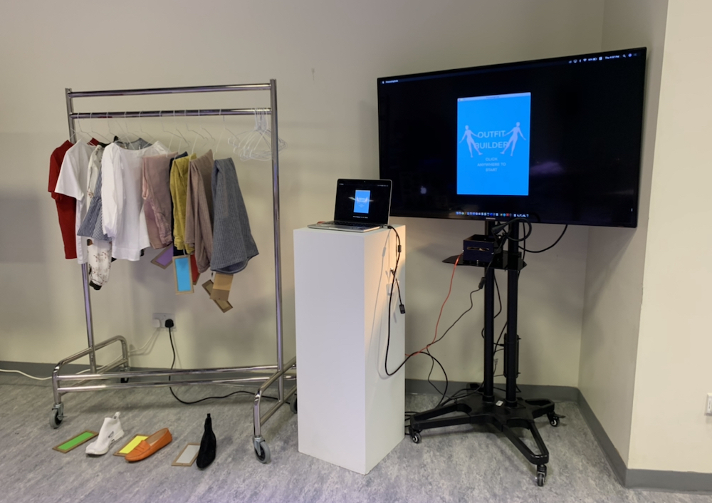
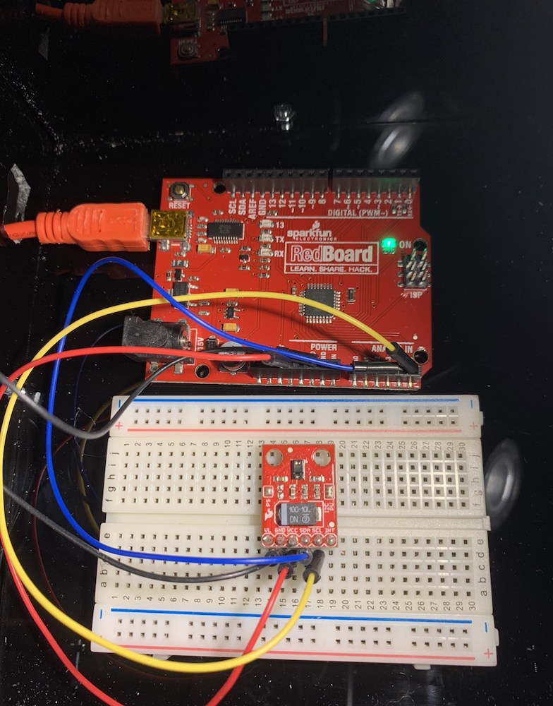
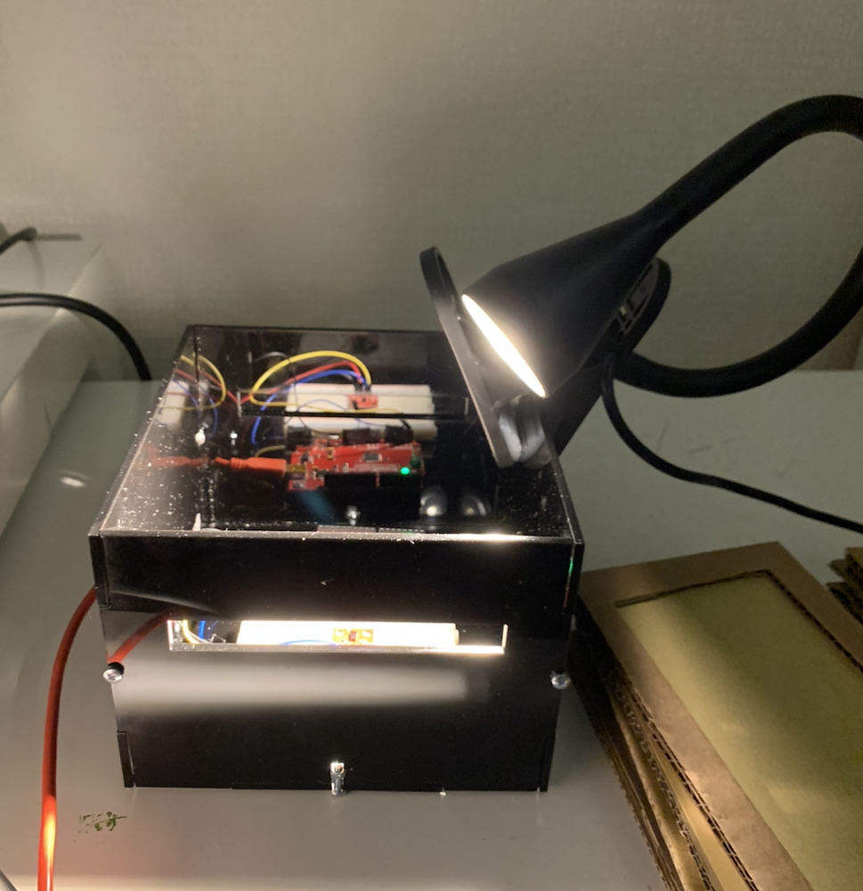
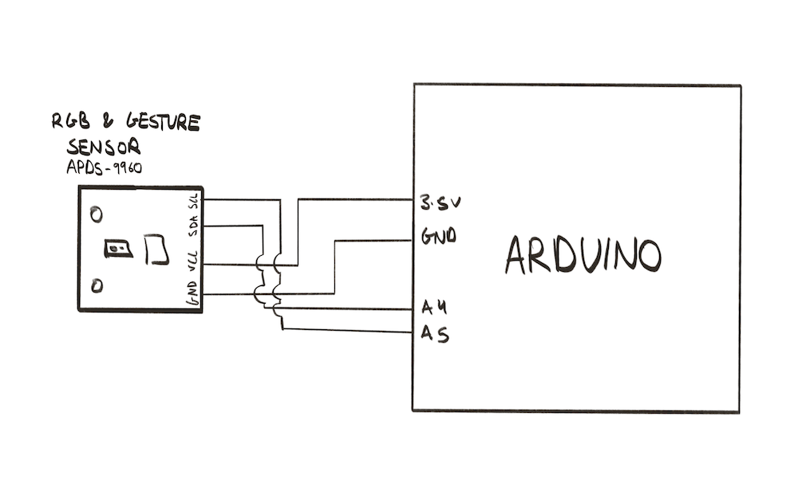

**Concept:**

The concept of my project is sort of an outfit builder. You choose individual parts of the outfit and visualize how it’d look like on the screen. This is sort of like if you have a large wardrobe or you go shopping and you don’t want to try everything on so the user could visualize how outfits would look together through this project. 

**Important parts:**

Color/Gesture Sensor and a desk lamp

** Images: **
Overall Picture:

Electronics:

Circuit:

**How it works and how I built it:**

My project has a color sensor and a controlled environment to sense that color. In more detail, the color sensor is in a box and the box has a slot where you could put in and a light source from the top and this is to fully control every aspect of the color sensor in order to get consistent readings. The actual circuit was simple, it is the sensor with the four wires connected, the VCC to 3.3V, GND to GND, SDA to A4 and SCL too A5. For the color cards I made a consistent card for each color. The cards were made by cutting cardboard into rectangles and cutting rectangles in the middle to put in the different colored paper. When the color sensor senses the cards it sends the RGB values to processing through serial communication separated by commas. In processing, the numbers are turned into an integer array for each of the colors red green and blue. As for the processing program, it has three different screens the start where it changes to the next screen when the mouse is clicked. Then it captures the face of the user (Help making this is from the capture example from the processing website as well as the save frame). The program captures a picture and moves on to the last screen where it resizes the image to be on the face area of an illustrated body. On that last screen depending on the RGB values scanned, each has a range of red, green and blue that I tested, it shows the corresponding image of the color card.

**Problems and Solutions:**

The problem I faced was the inconsistency of the color sensor readings. I attempted to use it normally but there wasn’t any/inconsistent readings because of the lack of light. I attempted to add LEDs and it still wouldn’t work. I attempted using it with a flash on my phone but because of the way I was holding the color paper it still wasn’t consistent. I then decided to make everything constant from the location of the sensor to the light, I used a flashlight instead of my phone, and the color cards. I made it into a tissue box but the printed paper still wasn’t consistent. I then went on to buy color construction paper, I made them into consistent cards that can be placed on top of the sensor and that seemed to work well. However, after a while I saw that the light decreased and thought it was probably because the flashlight was running on batteries and the light wasn’t consistent and so I bought a desk lamp and everything finally worked on the cardboard prototype and then I moved on to a smaller compact acrylic box and it worked just as well. 

**Feedback:**

When I was play testing I was getting an overall positive feedback. The constructive criticism was first the opening for the color card slots in the cardboard box being a little small where you’d have to be a little aggressive with it and so I made the slot slightly bigger. The second thing was the visuals of the cardboard box and how it ended up looking bulky, for this I ended up making the cardboard box look prettier but again I was told it still looks rough and so I ended up making the box smaller and used acrylic for it. Another thing was the camera position of where the people needed to stand for the portrait photograph however, I couldn’t change this so I opted to adding a mark on the ground on where people should stand Other than that it was mainly positive. 

**User Testing Videos:**

https://www.youtube.com/watch?v=5q1kDtdiTEQ&feature=youtu.be

https://www.youtube.com/watch?v=UDPSrbrPAUQ&feature=youtu.be

